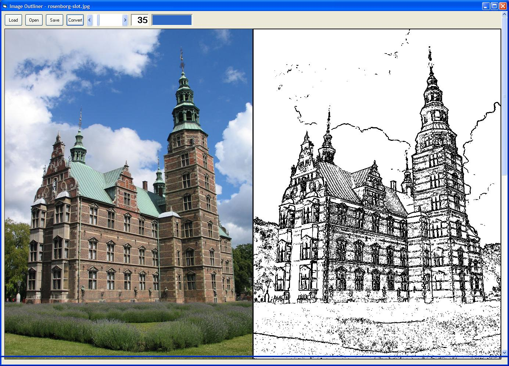



## Image Outliner

### Description

Image Outliner.. Well.. it outlines images. View the screenshot. The algorithm loops through all the color components of all the pixels in a picture determining if the difference if in colors is great enough to set a black pixel. This convert a picture to sort of a filt pen drawing.
 
### More Info
 

             |
---                |---
**Submitted On**   |2005-09-14 22:40:50
**By**             |[Lars Holm Jensen](https://github.com/Planet-Source-Code/PSCIndex/blob/master/ByAuthor/lars-holm-jensen.md)
**Level**          |Beginner
**User Rating**    |5.0 (25 globes from 5 users)
**Compatibility**  |VB 5\.0, VB 6\.0
**Category**       |[Graphics](https://github.com/Planet-Source-Code/PSCIndex/blob/master/ByCategory/graphics__1-46.md)
**World**          |[Visual Basic](https://github.com/Planet-Source-Code/PSCIndex/blob/master/ByWorld/visual-basic.md)
**Archive File**   |[Image\_Outl1946381152005\.zip](https://github.com/Planet-Source-Code/lars-holm-jensen-image-outliner__1-63172/archive/master.zip)

